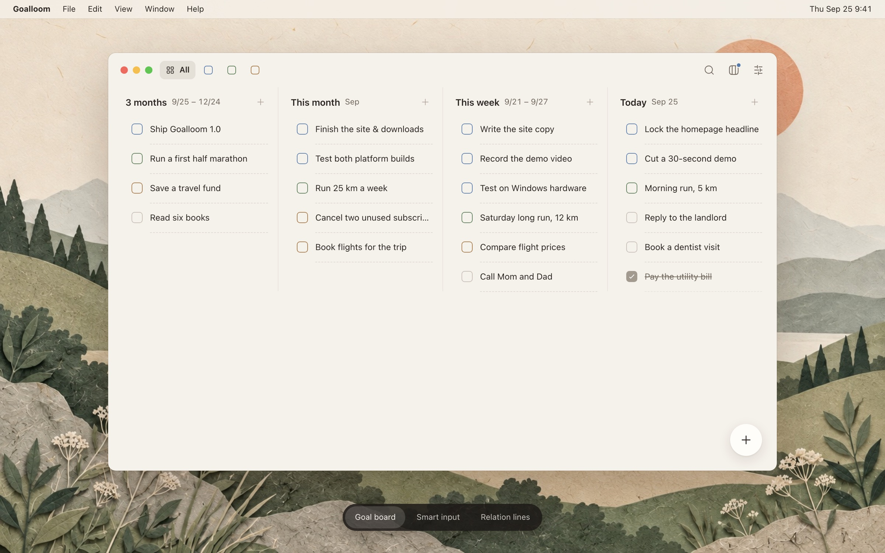

<p align="center">
  
</p>

<h1 align="center">Goalloom</h1>

<p align="center"><strong>Connect a quarter's direction to today's to-dos.</strong></p>

<p align="center">
  Goalloom is an open-source, local-first to-do app for macOS and Windows, built around OKRs.<br>
  Time columns answer <em>when</em>; goal links answer <em>why</em>—so the goals that matter stop losing to whatever feels urgent.
</p>

<p align="center">
  <a href="https://github.com/thinkingjimmy/goalloom/releases/latest"></a>
  <a href="https://github.com/thinkingjimmy/goalloom/stargazers"></a>
  <a href="./LICENSE"></a>
</p>

<p align="center">
  <a href="https://www.goalloom.com">Website</a> ·
  <a href="https://github.com/thinkingjimmy/goalloom/releases/latest">Download</a> ·
  <a href="./docs/development.md">Development</a> ·
  <a href="./docs/features/">Feature specs</a> ·
  <a href="https://x.com/hellojimmywong">X</a>
</p>

<p align="center">
  <strong>English</strong> | <a href="./docs/README.zh-CN.md">简体中文</a>
</p>

<p align="center">
  
</p>

# Key features

- **Goals and today on one board.** Five time columns—Later, 3 months, this month, this week, today—put the quarter's goals right next to what you do today.
- **Every to-do knows why.** Link an item to goals in longer horizons. Filter one goal (⌘1–⌘9) and relation lines draw its whole chain; hover any row to light its path. Links explain, they never roll up progress.
- **Write it down; Jev places it.** Optional smart input reads your goals and past to-dos, puts each new item in the right column and suggests the goal it belongs under. Preview and edit before creating, and undo a whole batch in one step. Bring your own key.
- **Nothing slips quietly.** Unfinished items roll over to the next period, and past periods stay readable and can be cleared in batches.
- **Undo anything, lose nothing.** Every change can be undone without touching your later edits; daily backups, plus safe restore and reset with a protective copy first.
- **Local-first and private.** Your workspace is a SQLite database on your computer: no account, no cloud, no content telemetry.
- **Made for the keyboard, in five languages.** ⌘N to capture, ⌘K to search, ⌘Z to undo. Chinese, English, Japanese, Spanish and French; paper or minimal style, light or dark.

# Get started

## Download

[Download the latest release →](https://github.com/thinkingjimmy/goalloom/releases/latest)

| Platform | Download |
| --- | --- |
| macOS 14+ (Apple silicon) | `Goalloom-<version>-mac-arm64.dmg` |
| Windows 11 (x64) | `Goalloom-<version>-win-x64.exe` |

The builds are **not notarized or code-signed** yet, so each platform needs a one-time step.

**macOS.** Open the DMG and drag Goalloom into `Applications`. macOS will otherwise report that the app "is damaged" or "can't be verified": that is Gatekeeper's quarantine flag on an un-notarized download, not a broken file. Clear it once from Terminal, then launch normally:

```bash
xattr -dr com.apple.quarantine /Applications/Goalloom.app
```

If it is still blocked, choose **Open Anyway** under System Settings → Privacy & Security.

**Windows.** SmartScreen shows "Windows protected your PC". Choose **More info**, then **Run anyway**, and follow the installer.

Your workspace lives in `~/Library/Application Support/Goalloom/` (macOS) or `%APPDATA%\Goalloom\` (Windows), with daily backups in `backups/`. Installing a newer version keeps it.

## Build from source

Requires Node.js 22.12 or newer and pnpm 11.9 (pinned in `package.json`; Corepack enables it).

```bash
git clone https://github.com/thinkingjimmy/goalloom.git
cd goalloom
corepack enable
pnpm install --frozen-lockfile
pnpm dev
```

To build local installers:

```bash
pnpm package:mac   # release/Goalloom-<version>-mac-arm64.dmg
pnpm package:win   # release/Goalloom-<version>-win-x64.exe
```

The [development guide](./docs/development.md) (Chinese) covers the full test suite, packaging checks, the repository map and the rules for contributors and coding agents. The marketing site lives in [`website/`](./website/README.md).

# Collaboration

Please use [GitHub Issues](https://github.com/thinkingjimmy/goalloom/issues) for bugs, feedback and proposals.

Goalloom is available under the [MIT License](./LICENSE).
