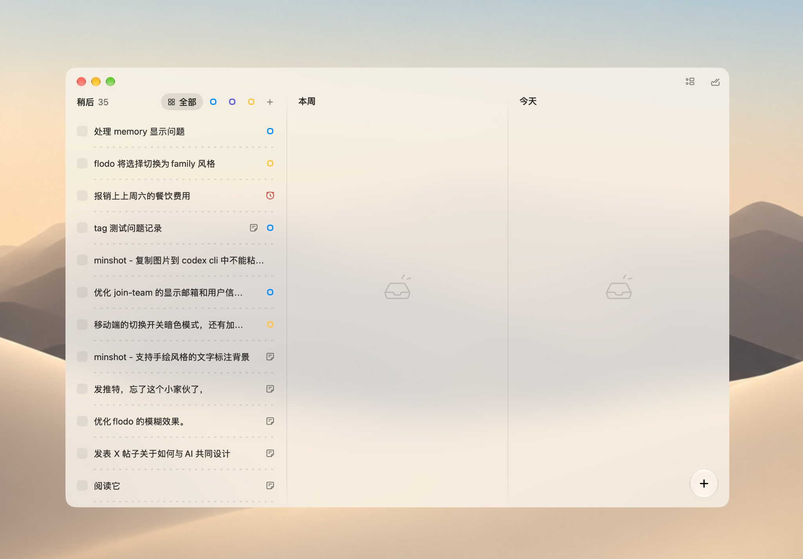
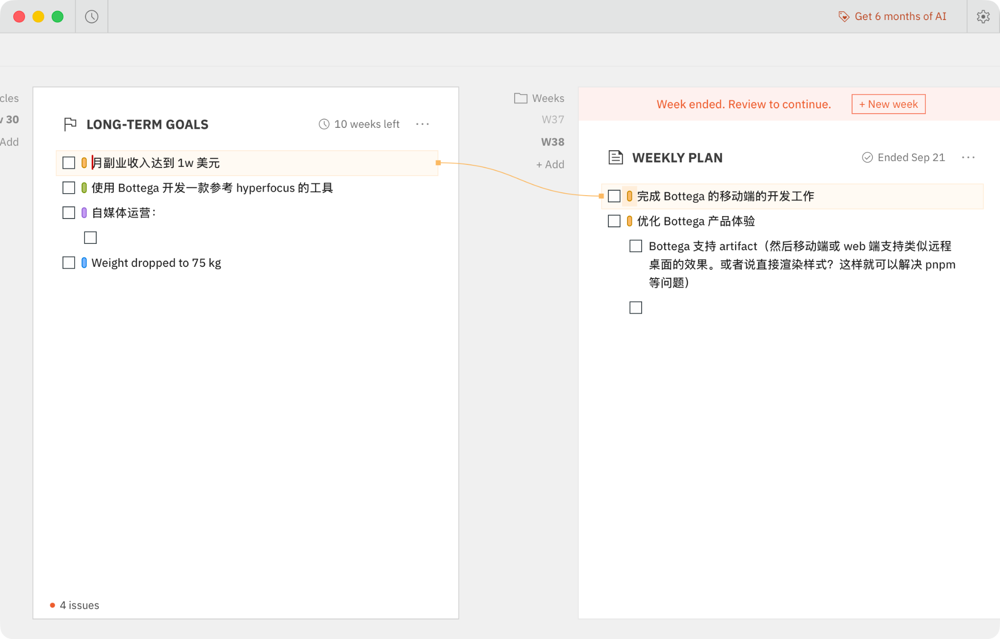

# Goalloom · 产品需求与开发规格

| 项目 | 内容 |
| --- | --- |
| 版本 | v0.3 · Electron 与历史 / 顺延方向已确认；未说明的工程细节为实施建议 |
| 日期 | 2026-09-21 |
| 产品 / 域名 | Goalloom / goalloom.com，域名购买由用户告知 |
| 平台 | macOS、Windows 本地桌面 |
| UI 约束 | shadcn/ui、Tailwind CSS |
| 框架 | **Electron，用户已确认**；保留 React / TypeScript / Vite / shadcn/ui / Tailwind CSS |
| 交付状态 | 只有文档与参考图，无应用实现、安装包或平台测试结果 |

## 1. 产品定义

**一个把长期方向与日常行动放在同一张时间看板上的个人 Todo。**

主界面不是 To do / Doing / Done，而是 Later / 3个月 / 本月 / 本周 / 今天。时间列回答什么时候做；关联回答为什么做。

借用 OKR 的对齐和拆解思想，不复制企业 OKR 的评分、贡献权重或管理流程。首版用真实条目关系帮助用户理解行动的目的，而非计算目标完成率。

## 2. 已确认与解释边界

已确认：五列顺序、目标关联、shadcn/ui + Tailwind CSS、Mac / Windows、本地桌面、自定义三个月周期、单一主位置、私人仓库及 Markdown TODO。

本轮用户确认「先 Electron」，并同意上一轮历史与顺延建议：按列翻阅过去、往期未完成入口、分时间尺度顺延策略、保留关键变化记录。完整规则见 [历史与顺延规格](HISTORY_AND_ROLLOVER.md)。

「暂不支持进度同步」在本版解释为：关联条目不自动汇总进度、不联动完成状态。为简化，建议首版完全不展示目标百分比、贡献权重或 KR 评分。原话与解释见 [决策记录](DECISIONS.md)。

关联一对多还是多对多、最低系统 / CPU 范围、周期参数细节仍待确认；不要将「主位置」误读成「只能关联一个主目标」。Electron 已不再是待选事项。

### 2.1 视觉参考

借鉴轻量列表、留白、弱分隔、克制元信息；不复制原品牌、真实个人事项或伪装平台按钮。

借鉴关联颜色、可追溯关系、跨时间并列；不强制周期结束锁屏，不将所有关系永久画成密集连线。

## 3. MVP 范围

| 范围 | 内容 |
| --- | --- |
| P0 核心 | 五列；录入 / 编辑 / 完成 / 重开；列内排序和跨列移动；目标关联选择器、标签、定位与选中高亮；基础搜索；按列历史翻页；往期未完成与批量安排；分时间尺度自动顺延、提示和撤销 |
| P0 数据 | SQLite 本地持久化；关键计划 / 状态事件；重启恢复；软删除与恢复；包含历史与设置的 JSON 导出 / 恢复；一致性备份；写入失败明确提示 |
| P0 平台 | Electron 在两种系统真实安装与运行；中文输入法、键盘操作、缩放、应用生命周期；选定的 CPU / OS 范围实际验收 |
| P1，另行批准 | 目标进度、KR、重复任务、提醒、普通分类标签、全局录入、任意未来周期排期、完整周期复盘与冻结快照、完整内容版本恢复、Markdown 导出、自动更新、原生毛玻璃增强 |
| 独立立项 | 账号、云同步、Web 正式版、移动端、团队协作、AI 拆解、外部日历集成、计费 |

首版不做完整 OKR 系统。选中态 SVG 连线可以在 P0 的标签 / 定位 / 高亮通过后增加，不成为唯一关联表达；不引入无限画布。

## 4. 信息架构

打开即看到五列：Later、3个月、本月、本周、今天。当前模式下每列包含标题、周期、未完成条目、折叠的已完成区与添加入口。

除 Later 外，各列支持前后翻阅过去周期与「回到当前」；本月回到当前的文案为「回到本月」。历史模式标出实际日期与「历史」标识，禁用直接添加、勾选和拖拽；只切换该列，不联动其他列。新一次启动默认显示当前周期。

采用手动处理策略的列，在当前模式顶部显示可折叠的「往期未完成 · N」；自动顺延后的条目显示原计划来源。当前待办和往期数量分别表达，不将旧承诺伪装成新计划。

详情使用侧边抽屉，包含标题、说明、计划位置、可选截止日期、关联条目、被关联的下级条目与关键活动记录。首版不放进度字段。从历史页打开时明确显示「当前任务」，操作修改现在，不回写过去。

辅助页面 / 面板：搜索、已完成、归档 / 回收站、设置。不增加第六个主看板列；完整周期复盘后置。

单列建议宽 260–340 px，各列独立纵向滚动；小窗口支持横向滚动与跳转今天。不通过极小字号硬塞五列。详情抽屉不让其他内容不可达。

## 5. 时间列与自定义周期

| 列 | 语义 | 建议日期规则 |
| --- | --- | --- |
| Later | 尚未承诺时间的事项 | 无周期 |
| 3个月 | 用户当前设定的一轮目标周期 | 自选起点，默认持续 3 个日历月 |
| 本月 | 当月要推进的事项 | 自然月 |
| 本周 | 本周计划 | 默认周一开始 |
| 今天 | 当天执行安排 | 工作区当地日期 |

时间列不等于截止日期，也不等于完成状态；不要求每个条目依次经过所有列。

### 5.1 自定义三个月

自定义是已确认需求。建议先仅允许选择起始日期，默认结束边界为起始日期加 3 个日历月。例如 `[2026-09-21, 2026-12-21)`，结束日不属于本周期。不是每天滚动的未来 90 天。

月底缺少同一日号时截断到目标月末；后续连续周期由原始锚点计算 `+3n` 月，避免日期漂移。历史周期不因设置变化被静默改写。是否支持任意时长或独立编辑结束日尚未批准。

自然月 / 周允许跨越三个月周期边界，不强制所有关联条目的日期范围完全包含。

### 5.2 单一主位置

每个条目只有一个 ID、一份状态、一个主计划位置。任务从本周移到今天后，不继续作为同一张卡片出现在本周或本月。

目标详情中可列出关联任务的引用；搜索可再次找到它。这些是引用视图，不是新任务或第二个主位置。历史月份中的任务记录同样是只读引用；当前看板计数不叠加历史引用。

### 5.3 移动与拆解

| 操作 | 结果 | 不发生 |
| --- | --- | --- |
| 本周移到今天 | 更新同一条目的位置与顺序 | 不复制、不删除关联、不改截止日 |
| 拆解下一步 | 新建不同 ID 条目并关联到原条目 | 不将父条目移走 |
| 9月顺延至10月 | 同一条目移至新的同类周期，写入顺延事件 | 不改截止日、关联和状态，不新建任务 |
| 修改关联 | 更新关系 | 不改时间列、不改完成状态 |
| 勾选完成 | 只修改该条目及其完成时间 | 不改父目标、其他关联项的状态或百分比 |

### 5.4 截止日期

可选 `due_date` 独立于计划列。移动不自动修改截止日期。只有明确的截止日期已经过去，才显示真正逾期；原计划昨天不自动等于截止日期逾期。

## 6. 录入、编辑与状态

每列可直接添加，全局新建默认 Later。标题去掉首尾空白后必填；同名条目允许，不通过标题合并。

Enter 提交、Esc 取消；中文输入法组合输入时 Enter 仅选词，不提交。说明先做简单文本；安全的基础 Markdown 渲染可作为增强，不引入块编辑器。

目标和任务共用条目数据结构。可选的类型只是帮助描述结果 / 动作，不形成 O / KR / Initiative 强制体系。

状态为待办、完成、取消；当前周期中完成的条目留在本列折叠区。旧周期遗留项直接完成时不再进入往期未完成区，其计划历史保留，并在已完成列表按实际完成日期出现。

完成、取消、归档与删除是不同语义。删除进入回收站，不级联删除任何关联条目；完成 / 重开 / 取消和可见性变化写入关键事件。首版不自动归档或删除长期未完成事项。

## 7. 关联：保留核心，去掉统计负担

### 7.1 实体引用，不是普通标签

用户通过「关联到…」搜索条目，看到名称、类型、所在列和周期后建立关系。标签保存真实 ID。改目标名称后，所有标签显示新名称；不能把名称复制成字符串关系。

普通分类标签暂不与目标关系混在一起；首版可不做单独的 tag 管理系统。

### 7.2 推荐的简化交互，尚待确认拓扑

UI 先只展示一种关联，不让用户选择主 / 次关系，不填写权重。数据草案是有方向的目标拆解关系：父目标 → 子目标 / 任务，允许跨列跳级，也允许同列关联。

**是否允许一个条目有多个上级尚未确认。** 技术文档暂用多对多方案展示；若最终采用单父树，应在首次生产迁移前加唯一父约束。不得误将 D04 的主位置唯一用于决定关联数量。

只要使用有向拆解关系，就禁止自关联、重复关系和直接 / 间接循环。关系校验在数据库事务内完成。

### 7.3 新建、解除、定位

选择器支持按标题搜索；不存在、已删除或会形成循环的目标不可保存。取消选择器不产生关系。

「拆解下一步」新建条目及关系必须同事务。建议列为三个月→本月→本周→今天；允许用户改列和跳级。

解除关系仅删除该联系，不删除条目、不更改状态或位置。点击关联标签打开目标详情；目标在当前视图之外时提示所在周期 / 归档状态，不能画一条错误连线。

### 7.4 显示与高亮

行内展示最多两个关联标签，更多折叠为 `+N`。颜色只是辅助，有文字 / 图标表达；不因关联变化强制改写条目自身颜色。

选中时高亮相关条目。若采用多对多，不虚构唯一祖先路径；首版直接展示上级 / 下级，深层路径使用有去重和访问上限的遍历。

SVG 连线只连接已渲染可见端点；列滚动、窗口调整与抽屉打开后重算。默认隐藏全部连线，文字标签始终可用。历史卡片不作为当前关系连线端点；历史引用所打开的关系是当前关系，不宣称还原当时的完整目标结构。

### 7.5 删除与恢复

删除目标先显示影响数量，仅使其关系失效，保留全部其他条目。恢复时重新校验关系；若恢复将成环，保留恢复的条目，提示有些旧关系无法自动恢复，绝不覆盖新数据。

归档不解除关系；引用已归档目标时显示状态提示。

## 8. 不做进度同步的精确定义

假设目标 A 关联任务 B、C。完成 B 后：B 显示已完成，A 和 C 状态不变，不生成 A=50% 的百分比，也不自动把 A 标为完成。

完成、取消或重开 A 也不会联动 B、C。目标是否完成由用户独立决定。首版不建立进度模式、手动百分比、分母统计、权重或 KR 字段。

引用标签可以显示 B 自身变为已完成，这是显示同一份数据，不是修改 A 的状态。关联关系与任务标题更新也应即时显示。

进度跟踪放入 P1，届时重新讨论任务完成率与真实目标成果的区别，不提前实现隐藏的聚合器。

## 9. 历史、往期未完成与自动顺延

本章为产品摘要；详细行为、例外和口径以 [HISTORY_AND_ROLLOVER.md](HISTORY_AND_ROLLOVER.md) 为准。技术字段见 [ARCHITECTURE.md](ARCHITECTURE.md)。

### 9.1 按列回看，浏览不改计划

日 / 周 / 月 / 三个月列可逐期回看过去，向前最多到当前周期。P0 不允许向未来翻页排期、不允许拖入历史周期。没有数据的过去周期显示空状态，不制造虚假任务或事件。

历史模式默认只读：点击记录可打开「当前任务」抽屉修改现在；已删除条目则打开删除状态 / 恢复入口。历史页不直接勾选完成，不把其他列一起拉回过去。

### 9.2 月初的往期未完成

本月列进入新月份后，未确认延续的旧任务在顶部显示「往期未完成 · N」，每项标明原计划月份；同一条目只出现一次。

支持批量「安排到本月」「移回 Later」，单项还可移到其他当前列、完成或取消。点击安排前旧 period_id 不变，处理后只有一个新主位置。暂不处理不阻塞看板；不要求强制回顾或延期理由。

### 9.3 设置：未完成事项处理

| 列 | 默认 | 可选 |
| --- | --- | --- |
| 今天 | 自动顺延到新的当天 | 手动安排 |
| 本周 | 手动安排 | 自动顺延到新的一周 |
| 本月 | 手动安排 | 自动顺延到新的月份 |
| 3个月 | 手动安排 | P0 不开放自动顺延 |
| Later | 无周期，不适用 | 无 |

自动顺延仅处理未完成、未归档、未删除条目，且只应用其唯一主位置对应的策略；不会连带移动父目标或子任务。

说明文案：**将未完成事项安排到新的同类周期。不会更改截止日期或目标关联。**

策略保存不偷偷搬走既有积压；从设置生效的当前周期开始适用。更早遗留仍由用户手动安排。关闭自动顺延不倒退已成功的计划变更。具体设置生效边界见详细规格。

### 9.4 自动顺延可见、可撤销

成功后显示批次提示，如「已将 3 项未完成事项从 9 月顺延到本月」，提供查看与撤销；任务保留「原计划：9月」等来源提示。

撤销只恢复仍未被后续修改的条目；有冲突时列出跳过项，不覆盖新安排或完成状态。已撤销项在本当前周期内不被再次自动顺延。原始操作与撤销记录均保留。

### 9.5 历史不能被后来的完成覆盖

9 月安排、10 月 1 日顺延、10 月 4 日完成：9 月历史显示「截至期末未完成；后续已顺延至10月」，10 月可显示该任务来自9月且于4日完成，已完成列表按实际完成日期归入10月4日。

历史展示分开「当时计划 / 状态」与「后来去向 / 当前状态」。标题和关联不做完整历史版本恢复，使用当前信息时须明确说明。若只是9月遗留项于10月直接完成、从未安排到10月，不伪造一条10月主计划记录。

本月→本周→今天是细化安排，只记录移动，不累计为三次延期。同尺度向后调期才记为顺延；重复检查、同列排序和撤销不增加有效顺延次数。

### 9.6 记录与本地生命周期

从首次真实写入开始记录创建、安排 / 移动、顺延、完成 / 重开 / 取消、归档 / 删除 / 恢复等关键变化。不是完整内容版本库，也不通过事件重放构建当前主看板。

启动、唤醒、前台恢复和日期变化时幂等检查；不依赖退出后的常驻服务。9月关闭、11月再打开时可直接从9月安排到11月，记实际执行时间，不伪造10月的一次后台顺延。

位置修改与事件写入同一事务，失败不得只成功一半。历史、顺延设置、相关批次与撤销抑制信息都纳入导出 / 恢复。旧数据没有事件时标明历史起点，不用当前状态倒推完整过去。

工作区时区和日历日期决定周期边界，时间戳保存 UTC；旧周期边界不因设置更改被静默重写。首版不做完整周期快照、评分、自动归档或自动删除。

## 10. 搜索、键盘与视觉

标题和说明至少支持中文连续子串搜索。搜索不限定在可见列或当前周期；结果可打开详情并显示其主位置。

建议快捷键 Cmd/Ctrl+N 新建、Cmd/Ctrl+K 搜索 / 命令、Esc 关闭。输入框内不拦截系统编辑快捷键。鼠标拖拽以外提供「移动到…」菜单和键盘替代。

通过 shadcn/ui 与 Tailwind CSS 定义自己的间距、颜色和密度；浅色、深色与跟随系统。先用不透明背景，毛玻璃不是核心验收前提。

支持可见焦点、屏幕阅读器名称、非颜色提示与减少动效。界面不得在 Windows 展示不可工作的 macOS 红黄绿按钮。

## 11. 本地数据与安全

不登录、不联网也能录入、关联、移动、搜索、完成并重启恢复。数据存应用数据目录中的 SQLite，不仅存在 React store / localStorage。

导出带 schemaVersion 的 JSON，包含任务、关系、周期、主位置、历史事件、顺延策略和批次信息；恢复先校验、预览影响、明确确认、备份，再事务替换。首版不做文件自动合并或同步。升级前创建一致性备份；恢复失败时保留原数据。

SQLite 默认不等于应用级加密，不宣传端到端加密。开发日志 / 遥测不记录私人任务正文；用户可见的本地历史与备份含私人数据，须按任务数据同等保护；主窗口只加载本地资源，说明或外部链接不能获得系统执行权限。

## 12. MVP 性能与验收

性能指标是待测目标，不是已达成结果。以 1,000 活跃条目、10,000 总条目测试初次显示、搜索、拖拽和关系高亮；记录设备、构建与测量方式。常见交互目标为即时反馈，长操作有明确进度 / 错误提示。

内存、冷启动与安装包体积在框架验证阶段测量，不采用别人的空应用 / 内存数据充当 Goalloom 数据。

完成标准：用户能离线创建三个月目标、拆出本月 / 本周 / 今天的独立条目，通过标签追溯关系，移动不丢关联，完成不改变其他条目，重启数据保留，跨周期任务不消失，按列回看历史不改变现在，自动顺延可追踪与安全撤销，并能可靠导出恢复全部关键历史。

全部承诺平台必须通过真实桌面测试；只有浏览器预览不算 Mac / Windows 支持完成。

## 13. Markdown 开发 TODO 摘要

- [x] 确认首版本地桌面、自定义三个月、单一主位置。
- [x] 记录「暂不做进度同步」的解释并收敛文档。
- [x] 确认 Electron 为首版框架。
- [x] 确认按列历史、往期未完成、分尺度顺延和关键变化记录。
- [ ] M0：确认关联拓扑、周期参数边界和平台支持范围。
- [ ] M1：建立 React / Vite + Electron 最小应用，验证受控 IPC、中文输入、拖拽、SQLite 和双平台安装。
- [ ] M2：实现五列、条目 CRUD、排序、独立状态、SQLite 与关键事件同事务写入。
- [ ] M3：实现实体关联、标签、定位、高亮和防环；不实现进度聚合。
- [ ] M4：实现按列历史、往期未完成、自动顺延设置 / 提示 / 撤销、完整导出恢复与失败回滚。
- [ ] M5：通过双平台实际验收并生成私人内测包。
- [ ] R1：明确批准后完成签名 / 公证、发布与升级检查。

完整任务见 [TODO](TODO.md)，业务用例见 [ACCEPTANCE](ACCEPTANCE.md)。本次勾选只涉及需求决定和文档，不代表应用开发完成。
