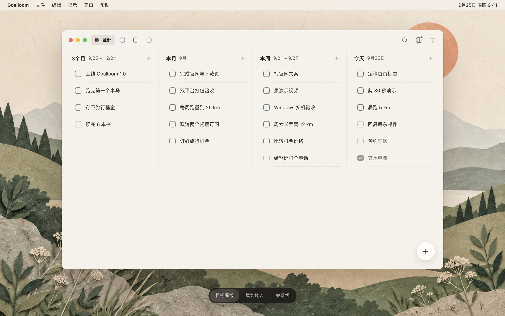

<p align="center">
  
</p>

<h1 align="center">Goalloom</h1>

<p align="center"><strong>把三个月的方向，连接到今天的行动。</strong></p>

<p align="center">
  Goalloom 是一款以 OKR 理念驱动、开源、本地优先的 Todo 应用，支持 macOS 与 Windows。<br>
  时间列回答「什么时候做」，关联回答「为什么做」——重要但不紧急的目标，不再被每天的急事淹没。
</p>

<p align="center">
  <a href="https://github.com/thinkingjimmy/goalloom/releases/latest"></a>
  <a href="https://github.com/thinkingjimmy/goalloom/stargazers"></a>
  <a href="../LICENSE"></a>
</p>

<p align="center">
  <a href="https://www.goalloom.com/zh-CN/">官网</a> ·
  <a href="https://github.com/thinkingjimmy/goalloom/releases/latest">下载</a> ·
  <a href="./development.md">开发文档</a> ·
  <a href="./features/">功能规格</a> ·
  <a href="https://x.com/thinkingjimmy">X</a>
</p>

<p align="center">
  <a href="../README.md">English</a> | <strong>简体中文</strong>
</p>

<p align="center">
  
</p>

# 核心功能

- **目标和今天，在同一块看板上。** 五个时间列——Later、3个月、本月、本周、今天——让季度目标就摆在今天要做的事旁边。
- **每件事都知道自己为了什么。** 把事项挂在更长周期的目标下。筛选一个目标（⌘1–⌘9），关系线会把它的整条链路连起来；悬停任意一行，就能看到它的上下游。关联只解释「为什么」，不汇总进度。
- **随手记下，Jev 帮你归位。** 可选的智能输入会参考你的目标和历史 Todo，把新事项放进合适的时间列，并推荐它属于哪个目标。创建前可预览、可修改，整批一步撤销。使用你自己的密钥（BYOK）。
- **没有事会悄悄溜走。** 到期未完成的事项自动顺延到下一个周期，往期记录随时可读，也能批量处理。
- **每一步都能撤销，数据不会丢。** 每次改动都能单独撤销，不影响你之后的编辑；每日自动备份，恢复或重置前先留保护副本。
- **本地优先，保护隐私。** 工作区是你电脑上的 SQLite 数据库：没有账号、没有云端，也没有内容遥测。
- **为键盘而生，支持五种语言。** ⌘N 新建、⌘K 搜索、⌘Z 撤销。界面支持中文、英文、日文、西班牙文和法文；纸感或简约风格，浅色或深色。

# 开始使用

## 下载

[下载最新版本 →](https://github.com/thinkingjimmy/goalloom/releases/latest)

| 平台 | 安装包 |
| --- | --- |
| macOS 14+（Apple 芯片） | `Goalloom-<版本>-mac-arm64.dmg` |
| Windows 11（x64） | `Goalloom-<版本>-win-x64.exe` |

## 首次打开

安装包暂未经过 Apple 公证，Windows 版也未签名，所以每个平台首次打开都需要手动放行一次。

**macOS。** 打开 DMG，把 Goalloom 拖进「应用程序」。否则 macOS 会提示应用「已损坏」或「无法验证开发者」：这是 Gatekeeper 给未公证下载加的隔离标记，文件本身没有问题。在终端执行一次下面的命令，之后正常打开即可：

```bash
xattr -dr com.apple.quarantine /Applications/Goalloom.app
```

如果仍被拦截，打开「系统设置 → 隐私与安全性」，在底部找到 Goalloom，点「仍要打开」。

**Windows。** 出现 SmartScreen「Windows 已保护你的电脑」时，点「更多信息 → 仍要运行」，再按安装向导完成。

工作区位于 `~/Library/Application Support/Goalloom/`（macOS）或 `%APPDATA%\Goalloom\`（Windows），每日备份在其中的 `backups/`。覆盖安装新版本会保留原有数据。

## 从源码构建

需要 Node.js 22.12 及以上与 pnpm 11.9（已在 `package.json` 中锁定，可由 Corepack 启用）。

```bash
git clone https://github.com/thinkingjimmy/goalloom.git
cd goalloom
corepack enable
pnpm install --frozen-lockfile
pnpm dev
```

打本地安装包：

```bash
pnpm package:mac   # release/Goalloom-<版本>-mac-arm64.dmg
pnpm package:win   # release/Goalloom-<版本>-win-x64.exe
```

完整测试、打包检查、代码地图以及贡献者与开发代理的约定见[开发文档](./development.md)。官网代码在 [`website/`](../website/README.md)。

# 协作

问题、反馈和建议请提交到 [GitHub Issues](https://github.com/thinkingjimmy/goalloom/issues)。

Goalloom 以 [MIT 许可证](../LICENSE)发布。
